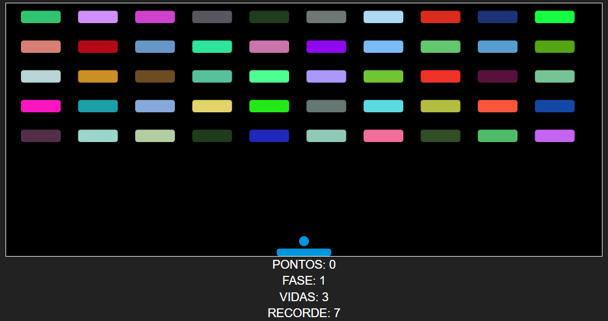
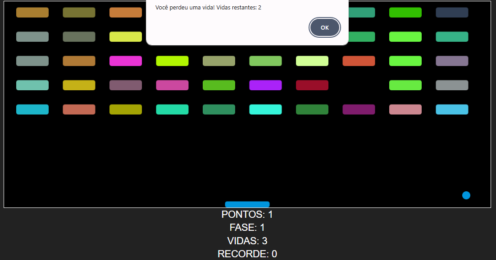
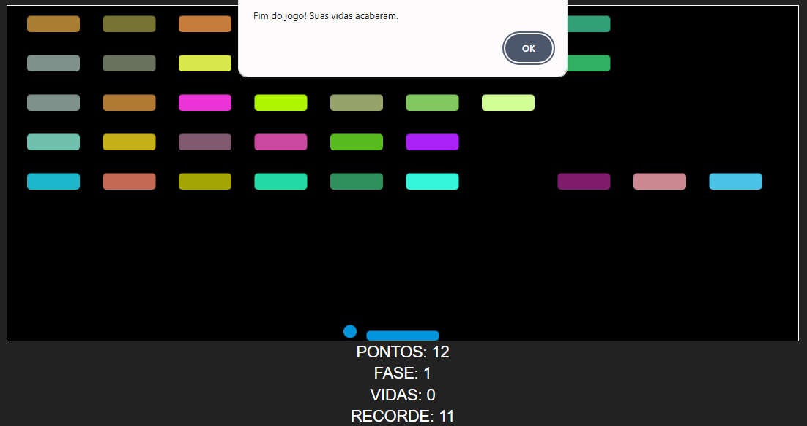

# 🎮 **Arkanoid** - Jogo Clássico com GUI

Este projeto recria o famoso jogo de arcade **Arkanoid**. O objetivo é controlar uma barra para rebater uma bolinha e destruir blocos coloridos. A cada fase, a dificuldade aumenta, proporcionando uma experiência desafiadora. O jogo é feito com **HTML5**, **CSS3** e **JavaScript**, e possui armazenamento de recordes usando **localStorage**.

---

## 📋 **Descrição do Projeto**

O jogo de **Arkanoid** tem como objetivo destruir todos os blocos da tela com a ajuda de uma bolinha que rebate na barra controlada pelo jogador. Cada fase traz novos desafios, aumentando a quantidade de blocos e a velocidade da bolinha.

O **recorde de pontuação** do jogador é salvo localmente no navegador, permitindo acompanhar o desempenho e melhorar a cada partida.

---

## 🚀 **Funcionalidades**

- 🕹️ **Controles Simples**: Use as setas do teclado para controlar a barra.
- 🎮 **Jogo Progressivo**: À medida que o jogador destrói os blocos, ele avança para novas fases, com mais desafios.
- 🔴 **Vidas Limitadas**: O jogador começa com 3 vidas. Quando perder todas, o jogo termina.
- 💾 **Registro de Recorde**: A pontuação mais alta é salva no `localStorage` do navegador.
- 🌈 **Blocos Coloridos**: Blocos com cores aleatórias são destruídos ao serem atingidos pela bolinha.
  
---

## 🖥️ **Tecnologias Utilizadas**

- **HTML5**: Estruturação do layout e dos elementos do jogo.
- **CSS3**: Estilização dos componentes e animações do jogo.
- **JavaScript**: Lógica de movimentação da bolinha, controle das fases e interação com os blocos.
- **localStorage**: Armazenamento do recorde de pontuação no navegador.

---

## 🖥️ **Tela do Jogo**



Legenda: Tela inicial do jogo, com a barra e os blocos prontos para serem destruídos.



Legenda: A bolinha em movimento, destruindo os blocos durante o jogo.



Legenda: Tela exibida quando o jogador perde todas as suas vidas.

---

## 🛠️ **Como Rodar o Jogo Localmente**

1. **Clone o Repositório:**
   ```bash
   git clone https://github.com/prof-leandro-teixeira/arkanoid
   cd arkanoid
